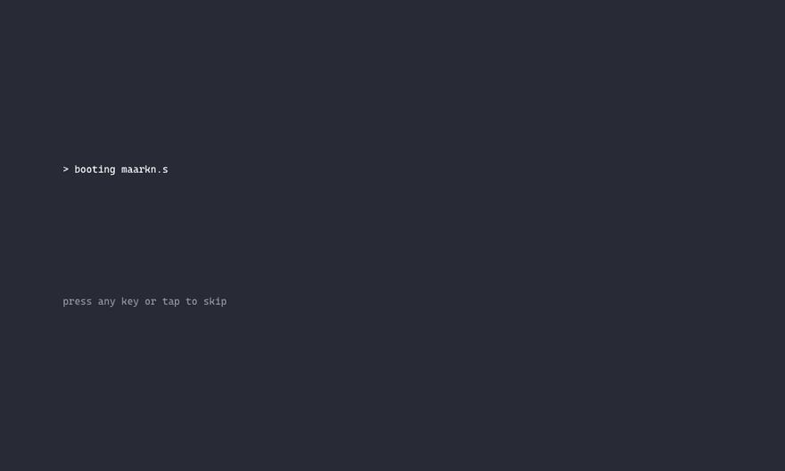
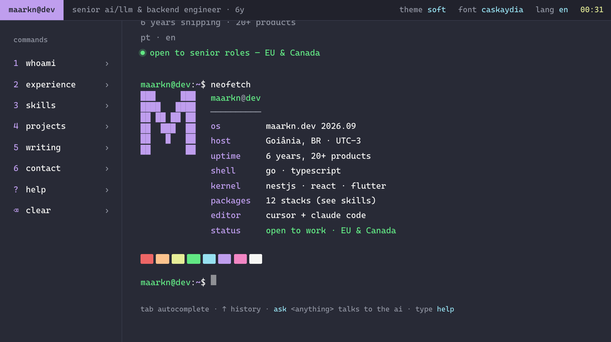

# maarkn.dev

> Personal portfolio of **Marco Filho** — senior AI/LLM & backend engineer working from Brazil with teams across Europe, the US and LatAm.

`maarkn.dev` is the digital business card of [@maarkn](https://github.com/maarkn). The home page is an interactive terminal: it boots, prints a `whoami`, and then hands you a prompt where every command prints something about me — career, stack, projects, posts, contact — or talks to an AI assistant trained on my CV. Recruiters and clients get the whole story in a couple of commands; everyone else gets a toy that is fun to poke at.

[Read this in Portuguese · Leia em português →](./README.pt-BR.md)



---

## What's inside

A [Next.js 16](https://nextjs.org) application in TypeScript, styled with CSS tokens + [Tailwind CSS v4](https://tailwindcss.com), fully internationalized (English and Brazilian Portuguese), self-hosted behind Traefik with Postgres.

### The terminal (home)

- **Boot sequence** — six lines typed character by character on the first visit of a browser session (3–5 s), skippable with any key or tap, skipped entirely under `prefers-reduced-motion`. `reboot` runs it again.
- **Shell** — tmux-style status bar (`maarkn@dev · title · theme · font · lang · clock`), a command menu with numeric shortcuts (`1`–`6`, `?`, `⌫`), a scrollable screen and a prompt `maarkn@dev:~$` with a synthetic cursor. On phones the menu becomes a horizontal strip at the bottom.
- **Command engine** — case-insensitive resolution with aliases (`about` → `whoami`, `work` → `projects`, `resume` → `cv`…), history with `↑`/`↓`, `Tab` autocomplete (commands, `cat <file>`, `cd <dir>`), `Ctrl+C` / `Ctrl+L`, async commands that can append or repaint lines while running, and an interactive prompt commands can take over to ask questions.
- **Content commands** — `whoami`, `experience`, `skills`, `projects` + `open <n>`, `writing` + `read <n>`, `contact`, `cv`, `ls` / `cat <file>`, `neofetch`. They only *format* what the rest of the site already knows: projects from the repository (Postgres with a static fallback), timeline and toolkit from `lib/`, posts from Ghost (mocked when the CMS is missing). Nothing is duplicated inside the terminal.
- **`ask <question>`** — the site's RAG assistant inside the terminal: streamed token by token, markdown rendered in the terminal's typography, conversation context kept for the session (`ask --new` forgets it), `Ctrl+C` aborts. Backed by `/api/chat` with a per-IP and daily rate limit, an admin log, and canned demo replies when no API key is configured. An optional flag forwards unknown three-word-plus input to the assistant.
- **`mail`** — the contact form as a conversation: name → email → company → message → `send? [Y/n]`, validated inline with the same Zod schema as the server action, `Esc` / `Ctrl+C` cancel, answers never enter the history, one message per minute per tab.
- **Navigation** — `cd projects|career|blog|links`, `cd ~` back home, `pwd`, `lang en|pt`, and deep-links such as `/en?cmd=projects` or `/pt-BR?cmd=whoami;skills`. The screen is rebuilt when you come back from an inner page; old anchors (`/#contact`, `/#projects`, `/#about`) still land on the right command.
- **Palettes and fonts** — two Dracula palettes, `soft` (default) and `classic`, and two monospace faces, Cascadia Code (default) and DaddyTimeMono, switchable from the bar or with `theme` / `font`. Applied before the first paint, persisted in `localStorage`.
- **Works without JavaScript** — the server renders the MOTD, the `whoami` output and a sitemap line, so crawlers and no-JS visitors still get the bio and every link. The shell adopts those lines when it hydrates.
- **Accessible** — WCAG 2.1 AA: semantic landmarks, skip link to the prompt, one boot announcement for screen readers, each command's output grouped as `output of <command>`, `Esc` to leave the prompt, 4.5:1 contrast in both palettes, `rem` sizing, 44 px touch targets.

### Inner pages

Every inner route survived the redesign with the same URLs, metadata and content; they just wear the terminal chrome now (status bar with the path, a `maarkn@dev:~$ cat projects/<slug>.md` breadcrumb, an 82ch column, a `cd ..` link back).

| Route | What it is |
|---|---|
| `/[lang]/projects` | All public projects in the `projects` command format, filtered by `?cat=` |
| `/[lang]/projects/[slug]` | Project detail: metadata table, description, role, features, gallery |
| `/[lang]/career` · `/career/[slug]` | The `experience` output with anchors, and the full case per position |
| `/[lang]/blog` · `/blog/[slug]` | Ghost CMS posts (ISR, 5 min) rendered in monospace prose |
| `/[lang]/links` | `cat links.sh`: email, LinkedIn, GitHub, WhatsApp, CV, Instagram, availability |
| `/[lang]/chat` | Permanent redirect to `/[lang]?cmd=ask` |

### Admin

`/admin` (no locale prefix) is a NextAuth-protected backoffice of 18 routes, pinned to the `soft` palette and always dark: a funnel dashboard, the application tracker as a list and as a board, the full dossier of an application, jobs, contacts, project CRUD with cover upload, a CV / cover-letter generator that draws on the knowledge base, MCP API keys and their audit log, the assistant's chat log, and settings. Sign in at `/admin/login`, drawn as a tty.

It speaks the same visual language as the public terminal, which is a decision, not decoration: a tmux-style status bar, a directory tree, a breadcrumb written as the command that opened the screen, `cd ..` in the footer, listings painted as `ls` output (bracket tags like `[applied]`, a decorative `001` index column, monospaced columns measured in `ch`), field errors printed as `stderr:` and toasts as a single output line. It is **not** a terminal: there is no prompt to type into and no command engine — the screens stay forms and tables. Every colour value is derived from the Dracula palette in `src/app/admin/admin.css`, where each deviation carries its measured contrast ratio.

Accessibility is held to AA on the private surface too, and measured rather than assumed. `scripts/a11y-admin-axe.mjs` drives headless Chrome over all 18 routes plus the five overlays that only exist after a click (the `Sheet` stays out while it is mounted on no route; `A11Y_SHEET_PATH=` brings it back): axe-core by default, `--keyboard` for the focus walk (focus always visible, no focus trap escape, Escape returns focus to the trigger), `--motion` for `prefers-reduced-motion: reduce` (with `--motion no-preference` as the negative control), and `--width 390` for the narrow sweep. Lighthouse accessibility is 100 on `/admin/login` and `/admin/applications`. Because the shadcn token vocabulary only resolves inside `.admin-root`, `scripts/check-admin-utilities.ts` runs as part of `pnpm lint` and fails the build if one of those utilities leaks into the public site.

### SEO and performance

Terminal-style OpenGraph images per route and per language, sitemap (no `/chat`), `hreflang` on every public route, JSON-LD for person and website, a single `h1` per page. The home ships about 24 kB of page-specific JavaScript (gzip, budget 60 kB), the markdown renderer loads on the first `ask`, `zod` on the first `mail`, and the alternative font is downloaded only when selected. Lighthouse mobile on the home after the migration (local, median of 3 runs): performance 96–97, accessibility 100, SEO 100, LCP 1.5 s with devtools throttling, CLS 0.

---

## Commands

What `help` prints, plus the ones it only mentions under *also try* and the easter eggs it does not mention at all.

| Command | Aliases | What it does |
|---|---|---|
| `whoami` | `1`, `about` | Name, role, bio and the four headline numbers |
| `experience` | `2`, `career` | Career timeline, newest first, with links to each case |
| `skills` | `3`, `stack` | Toolkit groups and capability bars |
| `projects` | `4`, `work` | Featured projects, numbered; `open <n>` opens one |
| `writing` | `5`, `blog`, `posts` | Latest posts; `read <n>` opens one |
| `contact` | `6` | Email, LinkedIn, GitHub, WhatsApp, CV, availability, timezone |
| `cv` | `resume` | Opens the PDF in a new tab |
| `mail` | | Send a message from the prompt (interactive) |
| `ask <question>` | | Talk to the AI assistant; `ask --new` starts over |
| `open <n>` · `read <n>` | | Open the n-th project / post of the last list |
| `ls` · `cat <file>` | | The fake filesystem: `whoami.txt`, `skills.sys`, `cv.pdf`… |
| `neofetch` | | System info with the monogram and the palette swatches |
| `help` | `?`, `h` | The list |
| `clear` | `cls`, `Ctrl+L` | Wipe the screen (also forgets the `ask` conversation) |
| `theme [soft\|classic]` | | Switch or set the palette |
| `font [caskaydia\|daddytime]` | | Switch or set the font |
| `lang [en\|pt]` | | Switch the language (persisted in the locale cookie) |
| `cd <dir>` · `pwd` | | Navigate to `projects`, `career`, `blog`, `links`; `cd` or `cd ~` returns home |
| `history` · `uptime` · `date` · `echo` · `whereami` | | The usual |
| `ping` · `git` · `reboot` | | Latency check, remotes, run the boot again |
| `sudo` · `rm` · `exit` · `logout` · `hack` | | Try them |

The full spec of every command (arguments, output, errors) lives in `.docs/design/commands.md` (local design notes, not versioned).



---

## Tech stack

| Layer | Choice |
|---|---|
| Framework | Next.js 16 (App Router, Turbopack, `output: standalone`) on React 19 |
| Language | TypeScript 5 |
| Styling | CSS custom properties (Dracula `soft` / `classic`) + CSS Modules + Tailwind CSS v4 (admin) |
| Fonts | Cascadia Code via `next/font/google` · DaddyTimeMono via `next/font/local` (self-hosted, OFL) |
| Animation | CSS only (`@keyframes` for the boot, line entrance and cursor) |
| i18n | Next.js dictionary pattern (`getDictionary`), locale routing in `src/proxy.ts` |
| Data | Postgres + pgvector via Prisma 6 (projects, applications, knowledge chunks, chat log) |
| Auth | NextAuth (Auth.js v5) with Credentials |
| AI | OpenAI Chat Completions + embeddings (RAG over `knowledge/`), SSE streaming |
| Blog | Ghost CMS Content API (headless, ISR) |
| Email | Resend (optional) |
| Tests | Vitest (pure modules + a few jsdom component tests) |
| Infra | Docker multi-stage image, Traefik v3 (TLS), GitHub Actions deploy to EC2 |

---

## Running locally

```bash
# install dependencies (Node 22, pnpm via corepack)
pnpm install

# start the dev server (http://localhost:5050)
pnpm dev

# lint (eslint + dictionary parity check), tests, production build
pnpm lint
pnpm test
pnpm build && pnpm start
```

> Port `5050` is used because `5000` is taken by the macOS AirPlay Receiver and `3000` was unstable locally. Override with `next dev -p <port>`.

### Environment variables

| Variable | Purpose |
|---|---|
| `OPENAI_API_KEY` | Optional. Enables the real assistant behind `ask` (and the admin generator). Without it, `ask` streams a few canned demo replies. |
| `OPENAI_MODEL` | Optional. Chat model, defaults to `gpt-4o-mini`. |
| `OPENAI_EMBEDDING_MODEL` | Optional. Embedding model for the knowledge base, defaults to `text-embedding-3-small`. |
| `OPENAI_GENERATOR_MODEL` | Optional. Model for the CV / cover-letter generator in the admin; falls back to `OPENAI_MODEL`. |
| `NEXT_PUBLIC_TERMINAL_ASK_FALLBACK` | Optional, default `false`. When `true`, unknown input with three or more words (not starting with `/`) is forwarded to `ask` after a notice. Public: inlined at build time, so rebuild after changing it. |
| `CHAT_RATE_MAX` / `CHAT_RATE_WINDOW_MS` / `CHAT_DAILY_MAX` | Optional. Assistant limits: messages per visitor per window (10 / 1 h) and per day site-wide (300). |
| `CHAT_IP_SALT` | **Recommended in production**, min. 16 chars (`openssl rand -base64 32`). Secret salt of the HMAC that pseudonymises the chat visitor's IP — the raw IP is never stored. **Missing: the app still starts**, logs one warning and uses a random per-process salt, so hashes stop being stable across restarts and workers: the per-visitor limit resets on every deploy and the admin stops grouping a visitor's sessions. `CHAT_DAILY_MAX` (site-wide) still holds the spend. |
| `TRUSTED_PROXY_HOPS` | Optional, default `1`, minimum `1`. How many trusted proxies sit in front of the app. The client IP behind every per-IP limit (login throttle, `/api/mcp`) is read from the **last** trusted `X-Forwarded-For` hop, never the leftmost one the client writes. Missing: `1`, correct for the current stack (Traefik only). Put a CDN/WAF in front and this must become `2` in the same commit, or those limits become bypassable again. |
| `LOGIN_TRUSTED_PROXY_HOPS` | Optional. Overrides `TRUSTED_PROXY_HOPS` for the login throttle only. Missing (or invalid): falls back to `TRUSTED_PROXY_HOPS`, then to `1`. |
| `RESEND_API_KEY` | Optional. When set, `mail` sends real emails. Without it, the payload is logged server-side and the success line is still shown. |
| `GHOST_URL` / `GHOST_CONTENT_API_KEY` | Optional. Ghost instance for `writing` and `/blog`. Without them, mock posts are served. |
| `DATABASE_URL` | Postgres (with pgvector) connection string. Required for the admin, the knowledge base and DB-backed rate limiting; every public read path falls back to static content when it is missing. |
| `AUTH_SECRET` | Required for the admin. Generate with `openssl rand -base64 32`. |
| `ADMIN_EMAIL` / `ADMIN_PASSWORD` | Read by `prisma/seed.ts` (`pnpm db:seed`) to create the admin user. |
| `UPLOAD_DIR` | Optional. Where admin uploads are written; the Docker image sets `/data/uploads`. |

Copy `.env.example` to `.env.local` and fill in only what you need. `.env.local` is gitignored; `.env.example` documents everything the app reads at runtime.

### Database, seed and knowledge base

```bash
pnpm db:up        # local pgvector container on port 5433 (or point DATABASE_URL at your own Postgres)
pnpm db:migrate   # prisma migrate dev
pnpm db:seed      # admin user + starter projects
pnpm db:ingest    # embed knowledge/**/*.md into pgvector (needs OPENAI_API_KEY)
pnpm db:studio    # Prisma Studio
```

`knowledge/` holds the CV and project dossiers the assistant answers from; only its README is versioned (see [`knowledge/README.md`](./knowledge/README.md)).

### Deploying

The production stack (Docker image, Traefik, Postgres, GitHub Actions → EC2) is documented in [`DEPLOY.md`](./DEPLOY.md).

---

## Project structure

```
src/
├── app/
│   ├── globals.css                 # Dracula tokens (soft/classic), fonts, base styles
│   ├── fonts.ts · fonts/           # Cascadia Code (Google) + DaddyTimeMono (self-hosted, OFL)
│   ├── manifest.ts · robots.ts · sitemap.ts
│   ├── _actions/                   # server actions: contact, auth, admin CRUD, generator
│   ├── api/chat/route.ts           # streaming assistant (RAG + rate limit + mock fallback)
│   ├── api/admin/upload/route.ts   # cover uploads
│   ├── admin/                      # the backoffice (no [lang]): 18 routes + admin.css, the scoped shadcn token values
│   └── [lang]/
│       ├── layout.tsx              # html, fonts, ThemeProvider, metadata, JSON-LD
│       ├── (terminal)/page.tsx     # the home: loads TerminalData, renders MOTD + whoami on the server
│       ├── (pages)/                # inner routes with the terminal chrome
│       │   ├── projects/ · career/ · blog/ · links/
│       │   └── */opengraph-image.tsx
│       └── chat/route.ts           # 308 → /[lang]?cmd=ask
├── components/
│   ├── terminal/
│   │   ├── terminal-app.tsx        # registers content + mail + ask + nav commands, mounts the shell
│   │   ├── terminal-shell.tsx      # bar + menu + screen + prompt + boot overlay
│   │   ├── use-terminal.ts         # React adapter: lines, history, autocomplete, shortcuts, session
│   │   ├── boot-overlay.tsx · status-bar.tsx · command-menu.tsx · screen.tsx · prompt.tsx
│   │   ├── output.tsx · line.tsx · primitives.tsx · markdown.tsx · motd.tsx · initial-output.tsx
│   │   ├── page-chrome.tsx · page-footer.tsx · route-chrome.ts · route-focus.ts
│   │   └── terminal.module.css · page.module.css · prose.css
│   ├── theme-provider.tsx          # palette + font state, pre-hydration boot script
│   ├── admin/                      # the backoffice: terminal chrome, listings, forms, dialogs, kanban
│   └── ui/                         # shadcn primitives — imported only from /admin (see check-admin-utilities)
├── lib/
│   ├── terminal/
│   │   ├── types.ts · registry.ts · parse.ts · complete.ts · history.ts · run.ts
│   │   ├── content-commands.tsx    # whoami … neofetch
│   │   ├── system-commands.tsx     # help, clear, theme, font, history, jokes
│   │   ├── nav-commands.tsx        # cd, pwd, lang
│   │   ├── ask-command.tsx · mail-command.tsx
│   │   ├── data.ts                 # assembles TerminalData on the server
│   │   ├── deeplink.ts · session.ts · anchors.ts · locale.ts · files.ts · listings.tsx · rich.tsx
│   ├── projects-repo.ts · projects.ts · timeline.ts · toolkit.ts · site.ts · ghost.ts
│   ├── chat-client.ts · chat-system-prompt.ts · chat-log.ts · rag.ts · embeddings.ts · rate-limit.ts
│   ├── contact-schema.ts · seo.ts · og.tsx · db.ts · auth.ts · uploads.ts
├── dictionaries/en.json · pt-BR.json
├── i18n/config.ts
└── proxy.ts                        # locale routing (Next 16's middleware)
prisma/                             # schema, migrations, seed
scripts/                            # check-dictionaries, check-admin-utilities (lint), ingest-knowledge,
                                    # check-commands-doc, a11y-admin-axe, a11y-dialog-accname
knowledge/                          # CV + project dossiers for the assistant (gitignored)
```

---

## Conventions

- Commits follow [Conventional Commits](https://www.conventionalcommits.org).
- Command and file names in the terminal stay in English in both languages; only descriptions and messages are translated, and `pnpm lint` fails when the two dictionaries drift.
- No `innerHTML`: every output line is a React node, and everything a visitor types is displayed literally.
- Content lives in `lib/` and the dictionaries; `lib/terminal` only formats it.
- Animations respect `prefers-reduced-motion` on both surfaces, and the admin's are checked against a negative control (`node scripts/a11y-admin-axe.mjs --motion` / `--motion no-preference`).
- The shadcn token vocabulary is admin-only; `pnpm lint` fails when it leaks into the public site.

---

## License

Source code is released under the MIT License. The personal copy, the CV and the knowledge base are © Marco Filho — please do not reuse them without permission. Fonts: Cascadia Code (OFL 1.1) and DaddyTimeMono (OFL 1.1), licenses next to the files in `src/app/fonts/`.

---

Built with care by [Marco Filho · @maarkn](https://linkedin.com/in/maarkn).
